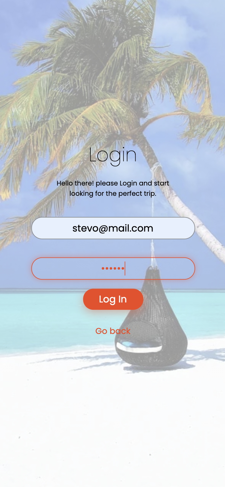
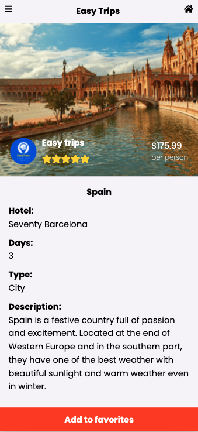
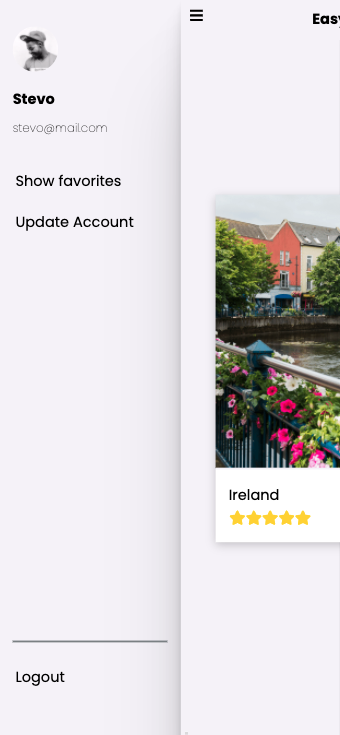

# Easy trips

> This is a mobile application that shows trips deal packages. A user can create an account and add it to their favorite list.

 

 

This project is the final capstone for Microverse, and it was made for learning purposes.
The project works in conjunction with an API that was built specifically for this project.
There can be Admin and regular profiles.
The regular profile can see the list of all trips, modify the profile and manage a personal favorite list.
Additionally, from the regular actions, the Admin profile can update and edit trip deals.
The only way to make an Admin profile is through the API, and is explained [here.](https://github.com/AlejandroNo4/capstone-api)

## Built With

- React 
- Redux
- [RoR API](https://github.com/AlejandroNo4/capstone-api)
- CSS
- Jest
- React Testing Library

## Live Demo

[Live Demo Link](https://easy-trips-no4.herokuapp.com/)

## Getting Started

To get a local copy up and running follow these simple example steps.

### Prerequisites

- Node.js installed.
- Vs Code

## Getting Started

To get a local copy up and running, follow these simple example steps.

- At first, you have to clone this repository. Open your terminal and paste this without the $ sign.

      $ git clone https://github.com/AlejandroNo4/easy-trips-frontend.git

- Now that you have the repository in your local machine. Change the direction of the local file with your terminal. Just type "$ cd" (without the $ sign) and the path to reach the easy trips folder. 
  Something like:

      $ cd User/Documents/easy-trips-frontend

- Now run 

      $npm install

- You are done with the installations! Now to run the project, first type:

      $ npm start

- This will automatically open the app on your browser.

 

## Run Tests

- On your terminal run

      $npm test a

## Author

👤 **Alejandro Contreras**

- GitHub: [@AlejandroNo4](https://github.com/AlejandroNo4)
- Twitter: [@Alejand80002666](https://twitter.com/Alejand80002666)
- LinkedIn: [Alejandro Contreras Rodriguez](https://www.linkedin.com/in/alejandro-contreras-rodriguez-b524821b5)

## 🤝 Contributing

Contributions, issues, and feature requests are welcome!

Feel free to check the [Issues page](https://github.com/AlejandroNo4/easy-trips-frontend/issues).

## Show your support

Give a ⭐️ if you like this project!

## Acknowledgments

- The design was based on [this one](https://www.behance.net/gallery/37706679/Circle-(Landing-page-Dashboard-Mobile-App), created by [Alexey Savitskiy](https://www.behance.net/alexey_savitskiy)

## 📝 License

This project is [MIT](./MIT.md) licensed.
